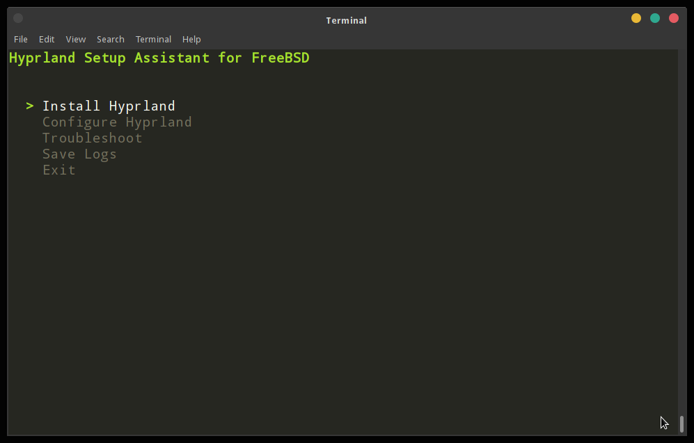

# Hyprland Setup Assistant for FreeBSD

Hyprland Setup Assistant is a Go-based command-line tool designed to simplify the installation, configuration, and troubleshooting of the **Hyprland** window manager on **FreeBSD**. This application ensures that all necessary packages are installed, environment variables are properly set, and services like **DBus** are up and running.

## Features

- **Install Hyprland** and its required components (e.g., `waybar`, `alacritty`, `wofi`, `dbus`).
- **Configure Hyprland** by copying a pre-configured `hyprland.conf` to the appropriate location.
- **Ensure DBus** is installed and running for proper Wayland support.
- **Set environment variables** such as `XDG_RUNTIME_DIR` automatically in `.profile`.
- **Troubleshooting** functionality to verify installation and check for common issues.
- **Log saving** feature to assist with troubleshooting and debugging.

## Prerequisites

Before running the application, ensure that you have the following:

1. **FreeBSD** system with `pkg` as the package manager.
2. **sudo** installed to allow the tool to manage packages and services with elevated privileges.
3. The **Go programming language** installed (for compiling from source).

## Installation

### Step 1: Install Go
Make sure Go is installed on your system:

```bash
sudo pkg install go
```

### Step 2: Clone and Build HyprSetup

Clone the HyprSetup repository and build the application:

```bash
git clone https://github.com/vimanuelt/HyprSetup
cd HyprSetup
go mod init HyprSetup
go mod tidy
go build -o HyprSetup .
```

### Step 3: Prepare the Configuration File

Make sure you have the `hyprland.conf` file in the same directory as the HyprSetup application.

### Step 4: Run HyprSetup

Once everything is set up, you can run HyprSetup:

```bash
./HyprSetup
```

HyprSetup will guide you through installing Hyprland and configuring it.

## Usage

Once you run `hyprsetup`, you will be presented with a menu that offers several options:

1. **Install Hyprland**:
   - Installs Hyprland and its dependencies (`wlroots`, `waybar`, `grim`, etc.).
   - Configures environment variables like `XDG_RUNTIME_DIR`.
   - Ensures `dbus` is installed and running.

2. **Configure Hyprland**:
   - Copies a predefined `hyprland.conf` file from the current directory to `~/.config/hypr/`.
   - Sets up default key bindings and layout options.

3. **Troubleshoot**:
   - Checks if `Hyprland` is installed and in the system `PATH`.
   - Verifies that `XDG_RUNTIME_DIR` is properly set.
   - Ensures `dbus` is running.

4. **Save Logs**:
   - Saves installation and configuration logs to `/tmp/hyprland_setup.log`.

5. **Exit**:
   - Quits the application.



## Configuration

- The **`hyprland.conf`** file is included in the current directory and will be copied to `~/.config/hypr/` during the installation process. You can modify this file according to your needs before running the setup.

### Example `hyprland.conf`

```ini
###################
### MY PROGRAMS ###
###################
$terminal = alacritty
$fileManager = dolphin
$menu = wofi --show drun

#################
### AUTOSTART ###
#################
exec-once = waybar &

#####################
### LOOK AND FEEL ###
#####################
general {
    gaps_in = 5
    gaps_out = 20
    border_size = 2
    col.active_border = rgba(33ccffee) rgba(00ff99ee) 45deg
    allow_tearing = false
}

decoration {
    rounding = 10
    active_opacity = 1.0
    inactive_opacity = 1.0
    blur {
        enabled = true
        size = 3
        passes = 1
    }
}

###################
### KEYBINDINGS ###
###################
$mainMod = SUPER
bind = $mainMod, Return, exec, $terminal
bind = $mainMod, E, exec, firefox
bind = $mainMod, M, exit
```

## Post-Installation

After completing the setup, you can start **Hyprland** using the following command from the terminal:

```bash
dbus-launch Hyprland
```

### Environment Setup

Make sure that `XDG_RUNTIME_DIR` is correctly set by either restarting your terminal or manually sourcing the `.profile`:

```bash
source ~/.profile
```

## Troubleshooting

1. **XDG_RUNTIME_DIR Not Set**:
   - Ensure that `XDG_RUNTIME_DIR` is set in `.profile`. You can check the value by running:
     ```bash
     echo $XDG_RUNTIME_DIR
     ```

2. **DBus Not Running**:
   - If `waybar` or other applications fail to start, ensure that `dbus` is running by executing:
     ```bash
     sudo service dbus start
     ```

3. **Failed to Install Packages**:
   - If the installation fails, make sure you have `sudo` permissions and the correct package repositories are enabled.

## License

This project is licensed under the **BSD 3-Clause License**.

## Contribution

If you would like to contribute, feel free to open a pull request or submit an issue on the [GitHub repository](https://github.com/vimanuelt/hyprland-setup).
